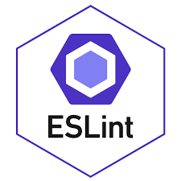

## Who needs standards? 
English is one of the most spoken languages in the world. Languages have structure which allows speakers to effectively communicate with each other. Programming languages on the other hand can be structured in many ways. The use of coding standards in languages like JavaScript can keep a team of engineers in the loop with one another. Coding standards provide a way for code to be written for long term support.

## Initial Thoughts

Over the past week, I have been working with git version control and ESLint in the background of the intelliJ IDE. Setting up a project with git through the GitHub Desktop app has made things simple. Using git allows me to keep track of  new versions of code as a project goes on. As projects go on, I am able to see the changes I've made in each push to origin. Implementing a version control with programming projects is an important standard to follow. As the amount of developers on a project grows, everyone will be able to have a copy of the code on their local machine. The changes developers make to their cloned repository will no automatically change the main code repository.

Ensuring proper code standards from the get go of some code was a challenge. At first, I found the red squiggly lines to be cumbersome. However, after going through the proper corrections to bring code up to ES6 standards, I have a grasp on what proper ES6 standards are. Because of this, I am frequently writing ES6 standard JavaScript code.

## Long-term Standards
Uniformity in projects is important for long term support. Even if a project I create is not important, I would still keep my code up to standards. Sticking with standards throughout my programming career ensures that I will be able to come back and understand to a minimal extent. 