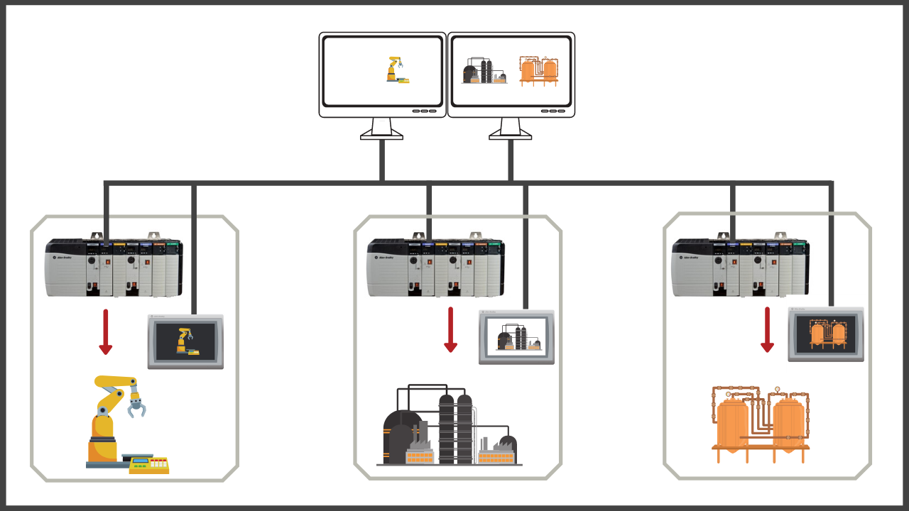
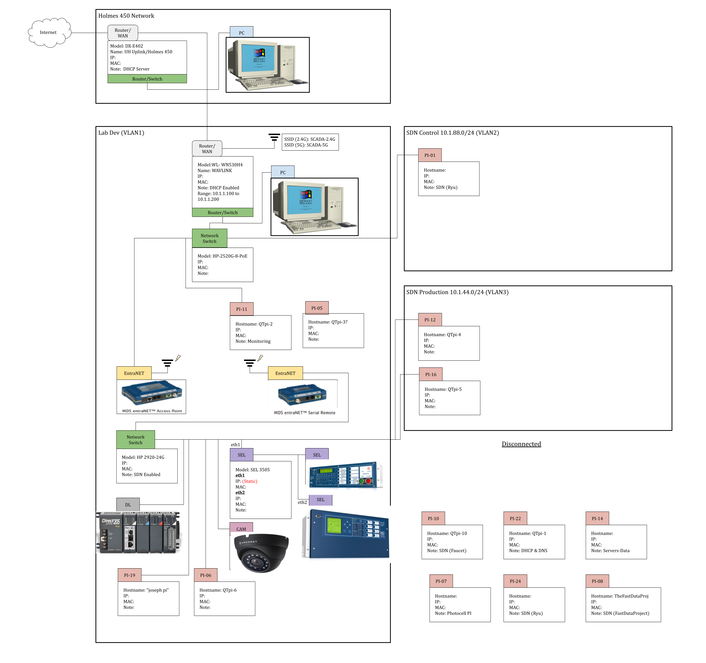

## SCADA Lab and Initial Design
SCADA Lab is a vertically integrated project within the University of Manoa College of Engineering. It is a team made up of EE, CENG, and ICS students under professor guidance. The goal of this project is to set up a small scale SCADA lab environment and implement security features with legacy industrial equipment. Along with the different SCADA equipment, the lab includes multiple RaspberryPis to run software to increase the security of the SCADA Lab. The system is built to model a substation and remote operation room. One simple security design was implemented to allow remote connection to SCADA hardware if the lights in the room are on.  

## Networking and System Administration 

During my time in the project, I was assigned roles for networking and system administration. Stepping into the roles of networking and system administrator was not an easy task. My prior experiences with either of the subjects was minimal and included connecting computers to my home network and allowing a router to handle the magic of assigning IP addresses. 

For networking, the first task was setting up a network diagram splitting the network into different subnetworks for various devices to connect to. One thing I learned while creating the network map was reserving certain IP addresses for certain devices with a MAC address. For the VLAN I learned about tagged traffic and configuring the RaspberryPi’s connected to different parts of the network to accept tagged traffic. 

## Teamwork Makes The Dream Work 
Without the network and different devices connected to it, there would be no real world model of a SCADA network. As a team, we were working on getting the SCADA equiptment up and running on the network. For example, this included contacting vendors of the equipment and speaking to knowledgable representatives to help SSH into equipment. A big achievement for the team was being able to trip a circuit remotely from one side of the SCADA Lab network. 