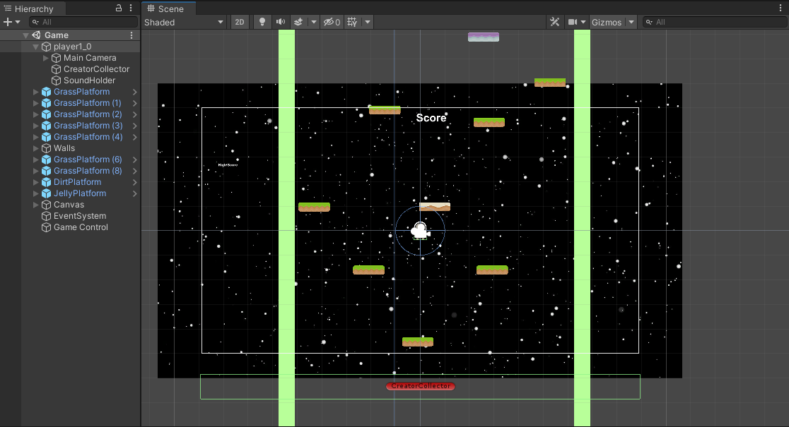

## Project Space Jump

Project Space Jump is a platform game that I created for EE 369, an interactive media systems and game design course. I worked by myself to implement my own recreation of Doodle Jump, a popular game on the App Store. Space Jump was made using the Unity game engine and C#. By the end, I was able to familiarize myself with Unity, C#, and the concept of a game loop.


## Unity Environment and C#

Working with Unity was a new experience for me. Prior to using Unity, the only game development I had done was with SFML and C++. The first thing I noticed was the ease in setting up a simple game environment. In a few hours, I was able to understand the basics of Unity and create game objects. Game objects are the core of any interactive game. Game objects make up a player and the environment the player interacts with. However, game objects alone are boring. In order to make things interesting, scripts are used to define mechanics like player movement. C# is used to program different behaviors for game objects.


## Unity Game Objects
An important aspect of Unity is the components available to be applied to game objects. One example of this is adding physics components to game objects. Physics components are important for platformer games because they can be used to define interactions between a player object and game objects in the environment. I was able to use physics components in the different ground objects in Jump to have different properties. I attached physics components to a grass, dirt, and jelly game object for platforms. With the physics components I was able to detect when a player collided with the platform and set different values of gravity to be applied to a player object upon collision with the different ground objects.


## Refactoring 
If I were to refactor the game, one major change would be in with the scripts. I created the project in a week and did not think of the D.R.Y, don’t repeat yourself, concept. Below is a script attached to a basic platform.

```
public class Platform : MonoBehaviour
{
    [Header("Set in Inspector")]
    public float jumpVelocity = 10f;
    private void OnCollisionEnter2D(Collision2D collision)
    {
        // coming from top of platform
        if (collision.relativeVelocity.y < 0f) 
        {
            Rigidbody2D rb = collision.collider.GetComponent<Rigidbody2D>();
            if (rb != null)
            {
                Vector2 velocity = rb.velocity;
                velocity.y = jumpVelocity;
                rb.velocity = velocity;

            }
            SimpleAudioManager.Instance.PlayGrassJump();
        }   
    }
}
```
I had multiple platforms which I created different scripts for. In order to follow D.R.Y, I would have to create only one platform script and attach it to different platform game objects. The platforms have a jumpVelocity variable for the amount of force applied to a different game object. In the platform script, I would have a switch case to add a force based on the name of the game object it is assigned to.

## Conclusion

Overall, learning to work with the Unity engine was a great experience for me. Once I created Jump, I was looking at other games and wondering how they could be implemented in Unity. Programming in C# was new to me, but the concepts from an object-oriented language like C++ was equivalent. In the future I would like to recreate more popular games with Unity. 