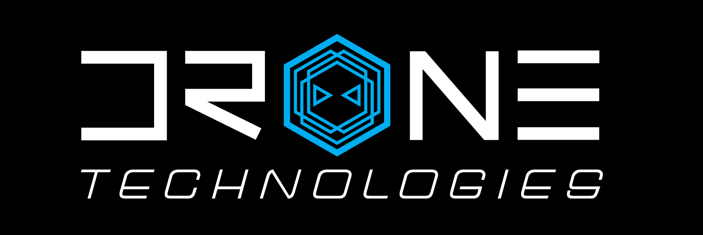
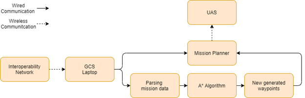

## UHDT

University of Hawaii at Manoa Drone Team, or UHDT, is a vertically integrated project part of the Electrical Engineering department. UHDT’s focus is building a drone to compete in the Association for Uncrewed Vehicle Systems International Student Unmanned Aerial Systems, AUVSI SUAS, competition. The drone must meet functional requirements set by a competition committee and autonomously fly while completing challenges around a flight course. The team is made up of students studying electrical, computer, and mechanical engineering. 

## UAV Subsystem
I was part of the team for a part of my sophomore and junior year. The team is broken into subsystems of engineers focusing on different parts of the drone. I was a part of the UAV subteam. At the time, the focus of the UAV subsystem was stationary obstacle avoidance. Stationary object data would be given to the team before flight and the goal was to generate a path for the UAV. A diagram for waypoint processing is shown below. 

In the UAV Subsystem I was in charge of completing proposal and update reports that were given during team and subsystem meetings. The research focused on search algorithms, specifically A* search algorithm. Past UHDT teams never implemented a form of stationary object detection so there was a lot of proof of concept write up to be done.

## Conclusion
Being a part of UHDT gave me first-hand experience of working on a large project. Every week team and subsystem meetings were held in order to keep everyone on the same page. I was able to contribute to a large project and work on my communication and engineering problem solving skills.    
